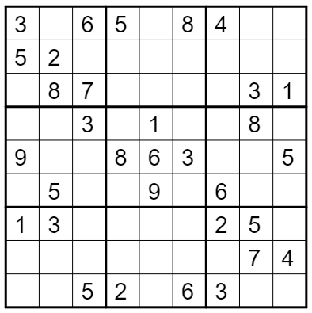

# sudoku

Sudoku puzzle generator and solver

<!-- TOC start (generated with https://github.com/derlin/bitdowntoc) -->

## Contents

* [Contents](#contents)
* [Overview](#overview)
   + [Rules of Sudoku](#rules-of-sudoku)
   + [Algorithms](#algorithms)
      - [Solution One: Brute Force](#solution-one-brute-force)
      - [Puzzle Generation](#puzzle-generation)
* [Usage](#usage)
   + [Basic](#basic)
   + [Handles](#handles)
* [Improvement Ideas](#improvement-ideas)

<!-- TOC end -->


## Overview

This program generates Sudoku puzzles and then solves them.

### Rules of Sudoku



Sudoku, in its basic form, is played on a 9x9 grid. The grid is subdivided into 9 boxes, each 3x3. The puzzle is presented with some number of cells containing values between 1 and 9, and the rest left blank. The player's goal is to fill in the blank cells.

Rules:
* In each row...
* In each column...
* In each box...

... no value is repeated twice. The digits between 1 and 9 are all present. The fewer filled-in cells (AKA clues) the puzzle contains, the harder it typically is. The player uses a process of elimination to try to solve the puzzle, applying the rules above.

### Algorithms

#### Solution One: Brute Force

The algorithm traverses the grid from top-left to bottom-right, applying a depth-first search approach. At each blank cell, the algorithm chooses a value, from those that are legal, then proceeds to the next cell. If it's impossible to find a legal value for that particular cell, the algorithm backtracks to the previous cell and tries a different value, then moves forward again.

#### Puzzle Generation

The generation algorithm attempts to populate each row by taking the set of integers between 1 and 9, shuffling them, and placing them one by one into the row. If a row can't be completed, due to running out of values that legally work, the algorithm clears the row and tries again. If, after some number of tries, it still can't complete the row, it starts over from scratch. In practice, this works pretty well.

Next, the algorithm takes the filled-in grid (example below), and adds blanks/spaces to it one by one. For each addition, the algorithm runs the brute force solver to make sure that the puzzle can be solved and that there is only one solution. 

The blanks are added using a depth-first scheme much like the one described for the brute force solution itself (above). That is, the algorithm starts with a shuffled list of all the coordinates on the grid. It proceeds through the list recursively, trying both a blank and no blank at each position. If a blank fails to work, the algorithm backtracks to the preceding coordinate and tries a different path. This can be rather slow for puzzles with a limited number of clues; since the goal is for the final generated puzzle to have only *ONE* solution, many possibilities must be tried.

```
+-------+-------+-------+
| 1 3 6 | 4 2 5 | 8 7 9 |
| 5 2 9 | 7 3 8 | 6 4 1 |
| 8 7 4 | 1 6 9 | 5 3 2 |
+-------+-------+-------+
| 4 9 7 | 2 1 6 | 3 8 5 |
| 3 8 5 | 9 7 4 | 1 2 6 |
| 6 1 2 | 8 5 3 | 4 9 7 |
+-------+-------+-------+
| 7 4 8 | 5 9 1 | 2 6 3 |
| 2 5 3 | 6 8 7 | 9 1 4 |
| 9 6 1 | 3 4 2 | 7 5 8 |
+-------+-------+-------+
```
`A grid that conforms to Sudoku rules`

Below, you can see a grid to which a number of blanks have been added.

```
+-------+-------+-------+
| 1 3 6 | 4 2 5 | 8 7 9 |
| 5   9 | 7 3 8 | 6 4   |
| 8 7 4 | 1 6 9 | 5 3 2 |
+-------+-------+-------+
| 4 9 7 | 2 1 6 | 3   5 |
| 3 8 5 | 9   4 | 1 2 6 |
| 6 1 2 | 8 5 3 | 4 9 7 |
+-------+-------+-------+
| 7 4 8 | 5 9 1 | 2 6 3 |
| 2 5 3 | 6   7 | 9 1 4 |
|   6 1 | 3 4 2 | 7 5 8 |
+-------+-------+-------+
```
`A grid with a few blanks (trivial to solve)`

A puzzle that's ready to be solved might look like this:

```
+-------+-------+-------+
| 8 5   |     1 |     6 |
|     7 |   6 4 | 1     |
|     4 |   7   | 5 9   |
+-------+-------+-------+
| 2     |   5 6 |     4 |
| 6     | 1   9 |   7   |
| 7   1 |   4   |     9 |
+-------+-------+-------+
|   1   | 9     | 4 6   |
|   9 6 |     8 |     7 |
|   7   | 6     |     1 |
+-------+-------+-------+
```
`A fairly easy puzzle`

## Usage

### Basic

For help:
```commandline
python sudoku.py --help
```

Run like:
```commandline
python sudoku.py --clues 36 --solve
```

The example above will create a puzzle with 36 clues (or 45 spaces), then solve it.

The fewer clues a puzzle has, the harder it will be to solve and the longer it will take to generate. If generation seems to be taking too long, try the `--forgiving` flag.

### Handles

Each randomly-generated puzzle includes a handle, which looks something like: `BydW+n79pAYagBQAaUkndzXyYSevzWDlpb8BgF6w6dFcY`

This allows puzzles to be recreated, like so:

```commandline
python sudoku.py --handle BydW+n79pAYagBQAaUkndzXyYSevzWDlpb8BgF6w6dFcY --solve
```

The resulting puzzle is:
```
O=======================O=======================O=======================O
‖       |       |       ‖       |       |       ‖       |       |       ‖
‖   2   |   5   |       ‖       |   7   |   4   ‖   8   |       |       ‖
‖       |       |       ‖       |       |       ‖       |       |       ‖
‖-------+-------+-------‖-------+-------+-------‖-------+-------+-------‖
‖       |       |       ‖       |       |       ‖       |       |       ‖
‖   9   |       |       ‖       |       |       ‖   2   |       |       ‖
‖       |       |       ‖       |       |       ‖       |       |       ‖
‖-------+-------+-------‖-------+-------+-------‖-------+-------+-------‖
‖       |       |       ‖       |       |       ‖       |       |       ‖
‖       |       |       ‖       |   8   |       ‖       |   5   |       ‖
‖       |       |       ‖       |       |       ‖       |       |       ‖
O=======================O=======================O=======================O
‖       |       |       ‖       |       |       ‖       |       |       ‖
‖   5   |       |   3   ‖       |   6   |       ‖       |   2   |       ‖
‖       |       |       ‖       |       |       ‖       |       |       ‖
‖-------+-------+-------‖-------+-------+-------‖-------+-------+-------‖
‖       |       |       ‖       |       |       ‖       |       |       ‖
‖       |       |       ‖   5   |       |   7   ‖       |       |       ‖
‖       |       |       ‖       |       |       ‖       |       |       ‖
‖-------+-------+-------‖-------+-------+-------‖-------+-------+-------‖
‖       |       |       ‖       |       |       ‖       |       |       ‖
‖   4   |       |       ‖       |       |       ‖       |   6   |   3   ‖
‖       |       |       ‖       |       |       ‖       |       |       ‖
O=======================O=======================O=======================O
‖       |       |       ‖       |       |       ‖       |       |       ‖
‖   7   |   3   |       ‖       |   2   |       ‖   6   |       |   9   ‖
‖       |       |       ‖       |       |       ‖       |       |       ‖
‖-------+-------+-------‖-------+-------+-------‖-------+-------+-------‖
‖       |       |       ‖       |       |       ‖       |       |       ‖
‖   6   |   4   |       ‖       |   9   |   3   ‖   7   |       |       ‖
‖       |       |       ‖       |       |       ‖       |       |       ‖
‖-------+-------+-------‖-------+-------+-------‖-------+-------+-------‖
‖       |       |       ‖       |       |       ‖       |       |       ‖
‖       |       |   9   ‖       |   4   |   6   ‖   3   |       |       ‖
‖       |       |       ‖       |       |       ‖       |       |       ‖
O=======================O=======================O=======================‖
```
_(Also found in `sample_puzzle.txt`)_

## Improvement Ideas


Possible future additions:
* Create "human-like" solver as an alternative to brute-force solver. This can gauge how hard a given puzzle is.
* Can ChatGPT or some other AI chatbot solve one of these puzzles?
* Add unit tests
* Add mode for human play